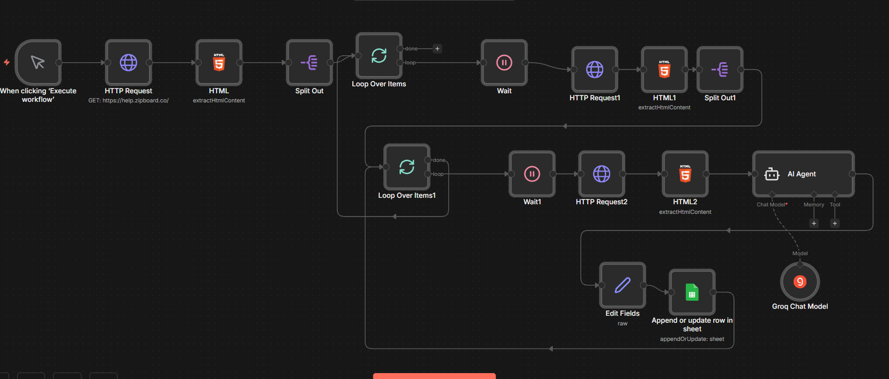
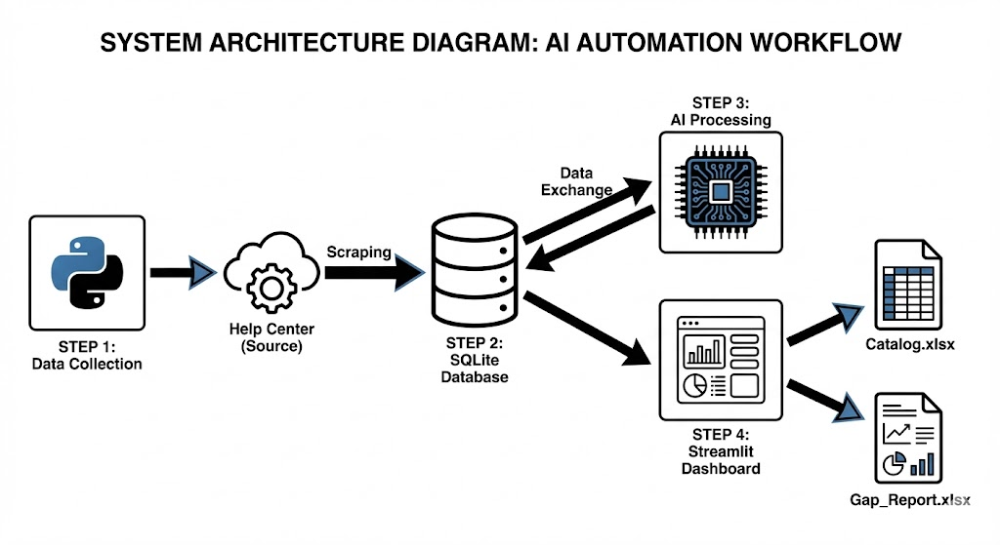

# 🤖 AI Automation Controller

## Overview
This system is an autonomous auditing tool designed for the ZipBoard Help Center. It automates the entire process of collecting content, analyzing it using advanced AI models, and generating professional gap analysis reports.

**Key Features:**
*   **🕷️ Smart Scraper**: Automatically fetches articles and categories from the help center.
*   **🧠 Multi-Model AI Agent**: Uses Llama-3.3-70b (with automatic fallback to Llama-3.1-8b and Mixtral) to analyze content strength and identify gaps.
*   **📊 Excel Reporting**: Generates formatted audit reports with metrics like Word Count, AI Content Type, and Strategic Gaps.
*   **⚡ Interactive Dashboard**: A premium Streamlit UI to control the entire pipeline without touching code.

## 🏗️ System Architecture

### 1. n8n Workflow


### 2. Python Script Workflow


---

## 🚀 Getting Started

### 1. Prerequisites
*   **Python 3.8+** installed on your system.
*   A **Groq API Key** (for the AI models).

### 2. Installation
Open your terminal in this directory and install the required dependencies:

```bash
pip install -r requirements.txt
```

### 3. Configuration
Create a file named `.env` in this folder (if it doesn't exist) and add your API key:

```ini
GROQ_API_KEY=your_groq_api_key_here
```

---

## 🖥️ How to Use (The Dashboard)

The easiest way to run the system is via the dashboard.

### 1. Launch the Dashboard
Run the following command in your terminal:

```bash
streamlit run dashboard.py
```

This will open the interface in your web browser.

### 2. The 3-Step Workflow

**Step 1: 📡 Collection (Start Scraper)**
*   Click **"Start Scraper"**.
*   The system will crawl the Help Center, extracting article titles, URLs, and word counts.
*   **Output**: Data is saved to `ai_automation.db`.

**Step 2: 🧠 Analysis (Start AI Agent)**
*   Click **"Start AI Agent"**.
*   The system sends each article to Groq's Llama-3.3 model.
*   **Smart Fallback**: If the API hits a rate limit, it automatically switches to a backup model (e.g., Llama-3.1-8b) or pauses until the limit resets.
*   **Output**: AI insights (Gaps, Suggestions, Content Types) are saved to the database.

**Step 3: 📊 Reporting (Generate Report)**
*   Click **"Generate Report"**.
*   The system compiles all data into an Excel file.
*   **Output**: A file named `AI_Audit_Report_YYYYMMDD.xlsx` will appear in your folder. You can also download it directly from the dashboard.

---

## 📄 Submission Deliverables

The system automatically generates the two key files required for your submission:

1.  **Article Catalog** (`AI_Audit_Report_YYYYMMDD.xlsx`)
    *   *Generated by Step 3*.
    *   Contains the full inventory of all articles with Word Count, Content Type, and detailed AI analysis for each page.

2.  **Gap Analysis Report** (`Strategic_Gap_Analysis_YYYYMMDD.xlsx`)
    *   *Generated by the Strategic Insights module*.
    *   Contains the Top 5 Strategic Gaps identified across the entire repository (Priority, Rationale, and Suggested Titles).

---

## 📂 System File Structure

*   `dashboard.py` - The main UI application.
*   `1_collect_data.py` - Script for scraping data.
*   `2_analyze_content.py` - AI processing logic with error handling.
*   `3_generate_report.py` - Excel report generator.
*   `ai_processor.py` - Core AI class managing models and prompts.
*   `database.py` - Database schema definitions.
*   `scraper.py` - Web scraping logic.
*   `config.py` - Configuration settings (URLs, DB path).
*   `ArticleCataloging.xlsx` - Contains all the articles cataloged.
*   `Gap_Analysis.xlsx` - Contains the gaps analysis report required.

---

## ❓ Troubleshooting

*   **Rate Limits (429 Errors)**: The system handles this automatically. If you see "Rate Limit Hit", just wait—it will sleep and retry or switch models on its own.
*   **Database Locked**: Ensure you don't have the `ai_automation.db` file open in another program (like DB Browser) while running scripts.
*   **Missing API Key**: If the AI fails immediately, double-check your `.env` file exists and has the correct key.
